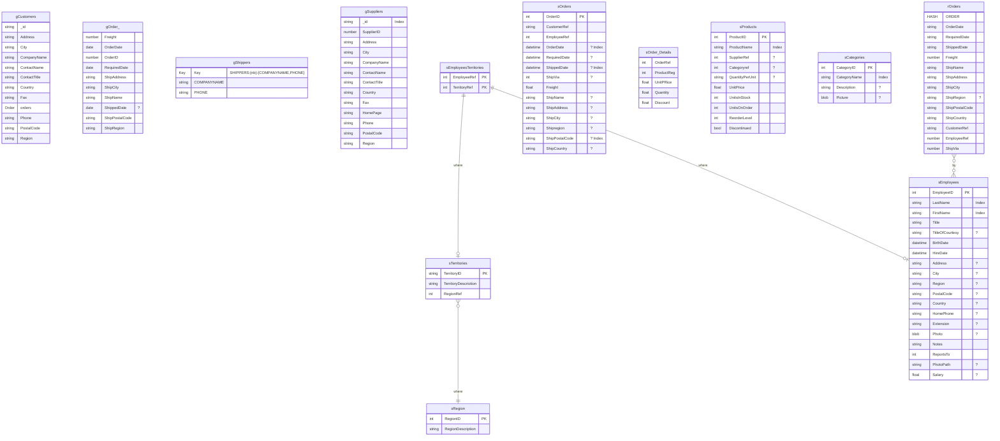

```mermaid
erDiagram
    gCustomers {
        string _id
        string Address
        string City
        string CompanyName
        string ContactName
        string ContactTitle
        string Country
        string Fax
        Order orders
        string Phone
        string PostalCode
        string Region
    }
    gOrder_ {
        number Freight
        date OrderDate
        number OrderID
        date RequiredDate
        string ShipAddress
        string ShipCity
        string ShipName
        date ShippedDate "?"
        string ShipPostalCode
        string ShipRegion
    }
    gShippers {
        Key Key "SHIPPERS:{nb}:{COMPANYNAME,PHONE}"
        string COMPANYNAME
        string PHONE
    }
    gSuppliers {
        string _id "Index"
        number SupplierID
        string Address
        string City
        string CompanyName
        string ContactName
        string ContactTitle
        string Country
        string Fax
        string HomePage
        string Phone
        string PostalCode
        string Region
    }
    rOrders {
        HASH ORDER
        string OrderDate
        string RequiredDate
        string ShippedDate
        number Freight
        string ShipName
        string ShipAddress
        string ShipCity
        string ShipRegion "?"
        string ShipPostalCode
        string ShipCountry
        string CustomerRef
        number EmployeeRef
        number ShipVia

    }
    sOrders {
        int OrderID PK
        string CustomerRef
        int EmployeeRef
        datetime OrderDate "? Index"
        datetime RequiredDate "?"
        datetime ShippedDate "? Index"
        int ShipVia "?"
        float Freight
        string ShipName "?"
        string ShipAddress "?"
        string ShipCity "?"
        string Shipregion "?"
        string ShipPostalCode "? Index"
        string ShipCountry "?"
    }
    sOrder_Details {
        int OrderRef
        int ProductReg
        float UnitPRice
        float Quantity
        float Discount
    }
    sProducts {
        int ProductID PK
        string ProductName "Index"
        int SupplierRef "?"
        int Categoryref "?"
        string QuantityPerUnit "?"
        float UnitPrice
        int UnitsInStock
        int UnitsOnOrder
        int ReorderLevel
        bool Discontinued
    }
    sRegion {
        int RegionID PK
        string RegionDescription
    }
    sCategories {
        int CategoryID PK
        string CategoryName "Index"
        string Description "?"
        blob Picture  "?"
    }

    sTerritories {
        string TerritoryID PK
        string TerritoryDescriotion
        int RegionRef
    }
    sEmployees {
        int EmployeeID PK
        string LastName "Index"
        string FirstName "Index"
        string Title
        string TitleOfCourtesy "?"
        datetime BirthDate
        datetime HireDate
        string Address "?"
        string City "?"
        string Region "?"
        string PostalCode "?"
        string Country "?"
        string HomePhone "?"
        string Extension "?"
        blob Photo "?"
        string Notes
        int ReportsTo
        string PhotoPath "?"
        float Salary "?"


    }
    sEmployeesTerritories {
        int EmployeeRef PK
        int TerritoryRef PK
    }

    sEmployeesTerritories ||--o| sTerritories : where
    sEmployeesTerritories ||--o| sEmployees : where
    sTerritories }o--|| sRegion : where
    rOrders }o--o{ sEmployees : by

```
